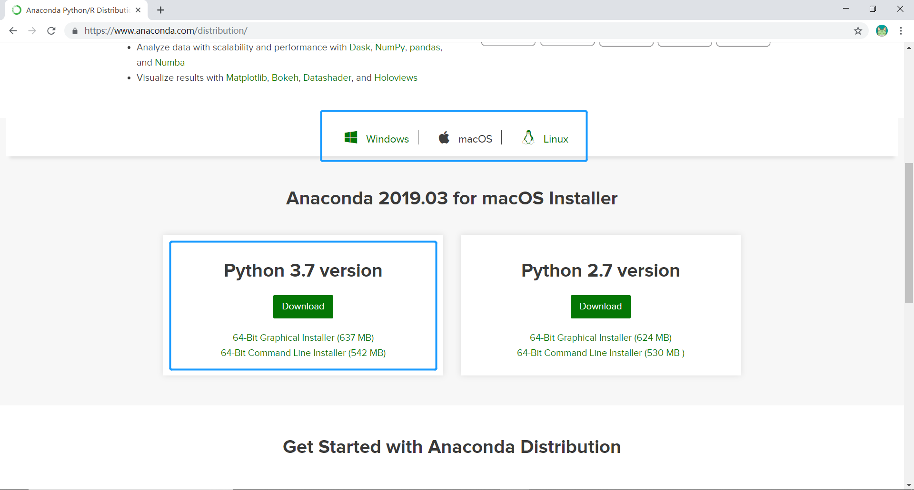
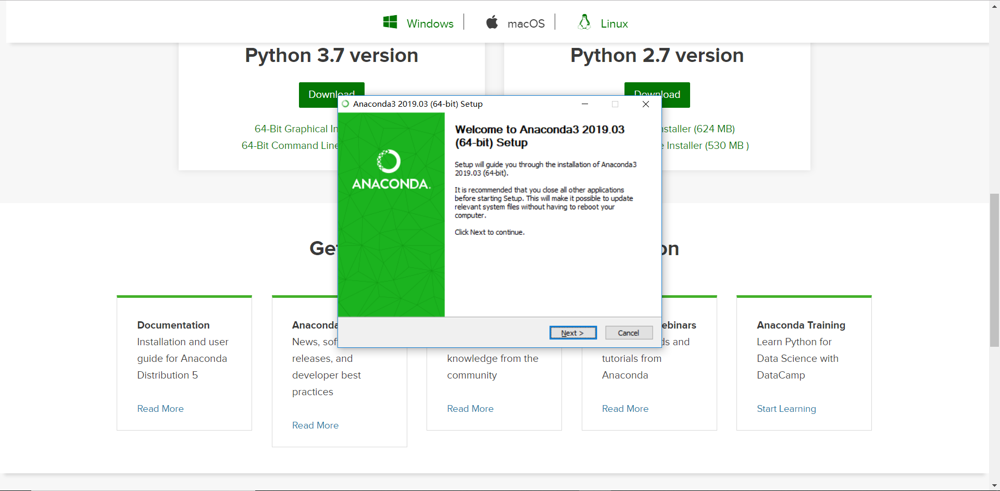
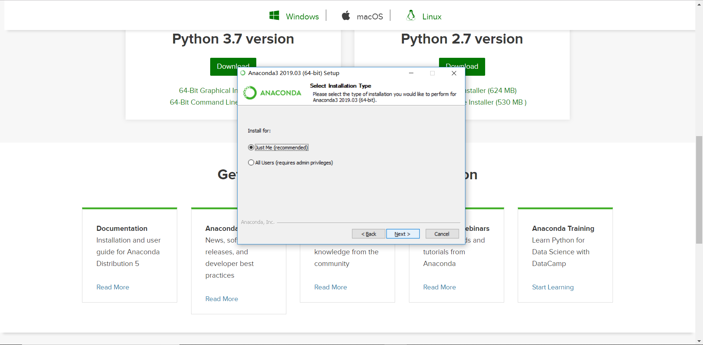
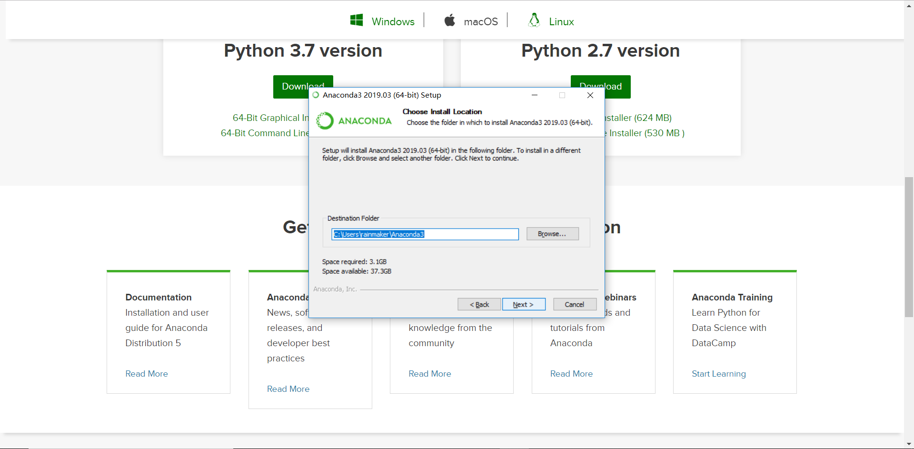
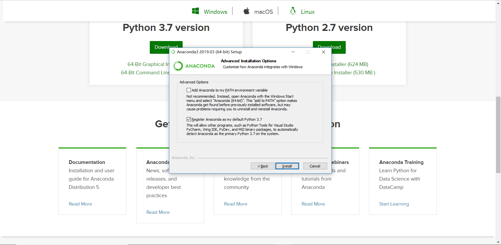
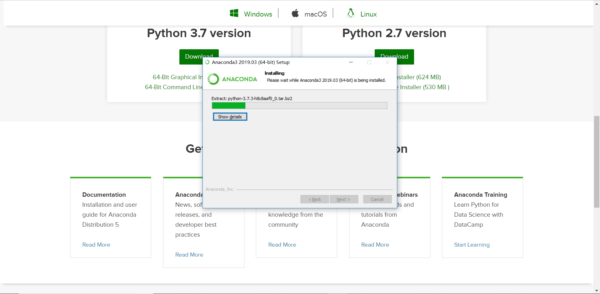
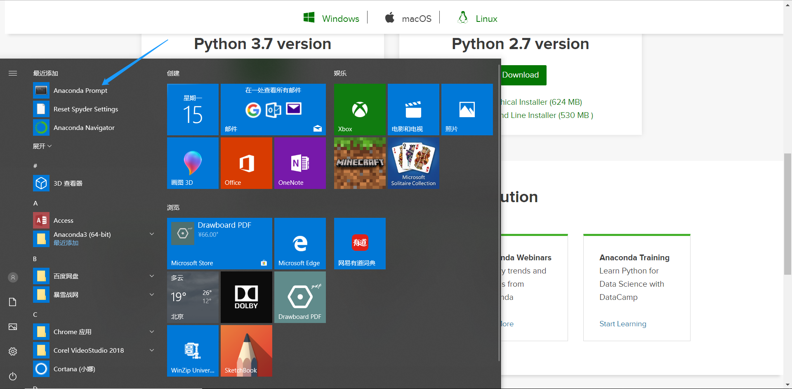
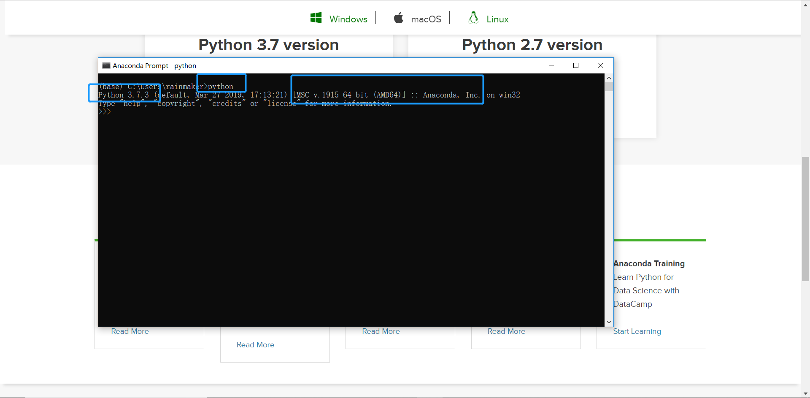

# WTM 北京 2019 Python 从 0 到 1 工作坊

## 主要内容

围绕使用 Python 的一个重要场景「数据获取、处理与分析」展开用入门编程的第一课。介绍一下内容：

1. Python 的基本介绍
2. Python 的环境安装
3. Python 最基本的语法
4. 用 Python 处理 csv 格式的数据
5. 用 Python 获取网页中的数据

## Python 的基本介绍

Python 

## Python 环境的安装

介于我们会更倾向于用 Python 做数据的获取、处理与分析，我们推荐大家使用 Anaconda，一个基于 Python 做数据分析处理与机器学习的开发环境安装包。它打包了在这个场景下会经常使用的重要工具、类库。大大简化了环境安装的成本。

首先打开官网 [https://www.anaconda.com/distribution/](https://www.anaconda.com/distribution/) 按照自己的操作系统的不同选择不同的安装包下载。

### 安装流程

首先在下载页面看到如下的界面，依据自己的操作系统选择 Windows / macOS 或者 Linux。

注意这里下载 **Python 3.7 version**，后面的教程全都基于这个版本。我们以 Windows 为例，下载 **64 Bit Graphical Installer**，有 600MB+，还是需要一阵子才能下载完成。

下载完成后双击下载包，如下所示：

点击下一步，采用默认的配置。

继续下一步，可以看到这次安装需要 3.1 GB 的空间，注意为自己的电脑腾出这么多空间。

下一步，保持下图中的配置：

继续下一步，开始安装：

视具体电脑配置不同，可能需要 5 到 10 分钟的时间。

安装完成后，在「桌面」点击「开始」，可以看到新安装的 Anaconda 组建：

我们之后主要用到的是「Anaconda Prompt」以及「Anaconda Navigator」。

### 使用 Anaconda 打开 Python 

在「开始」菜单中点击「Anaconda Prompt」会跳出一个黑色的框框，也就是「命令行窗口」。

