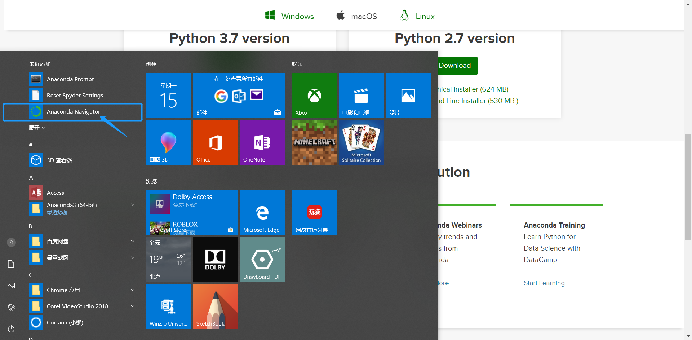
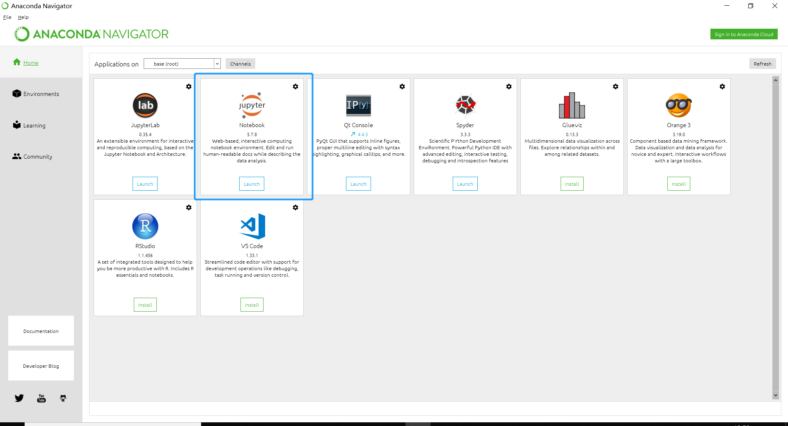
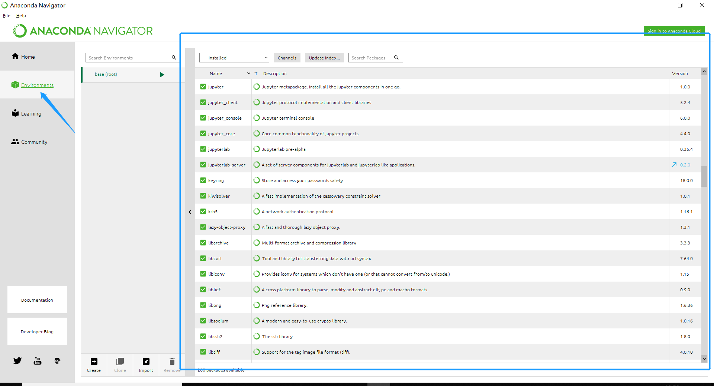
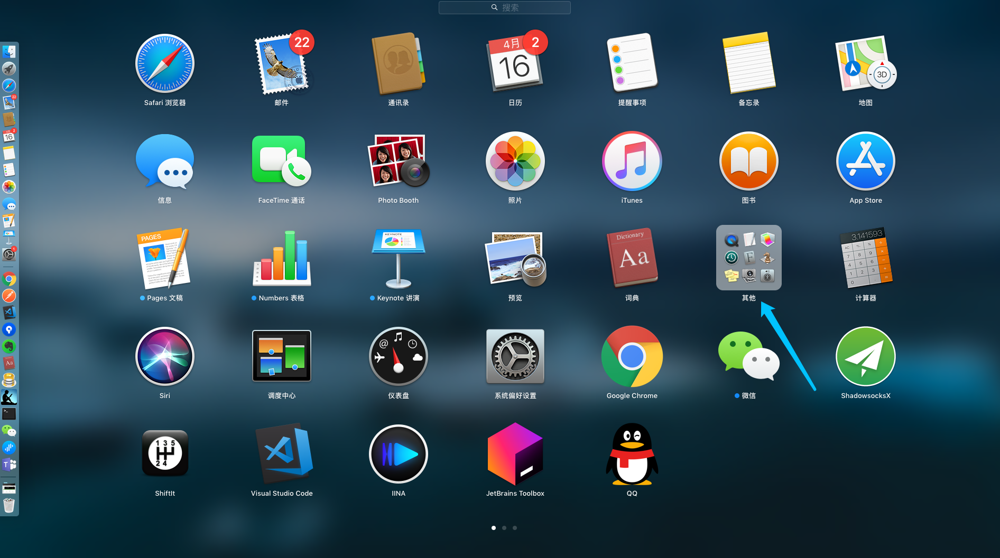
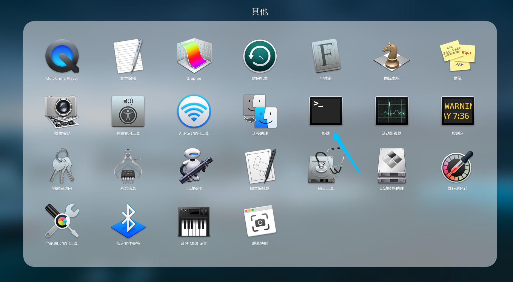
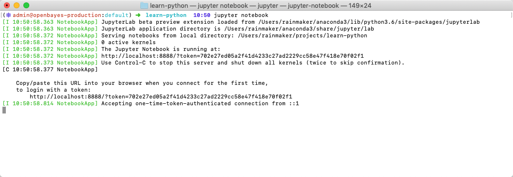
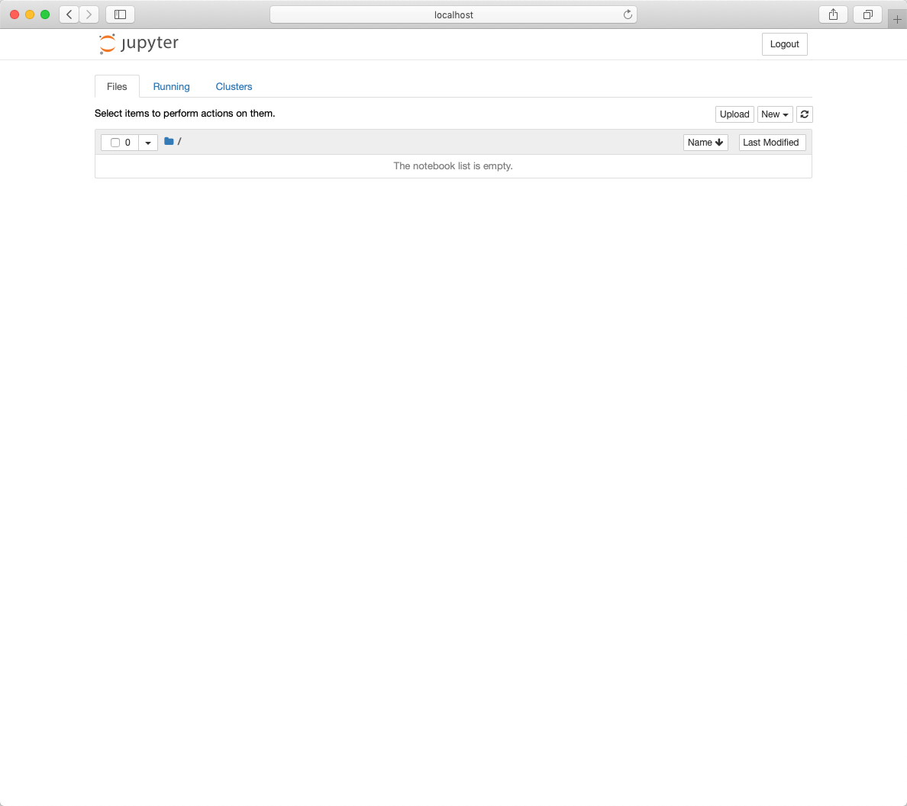
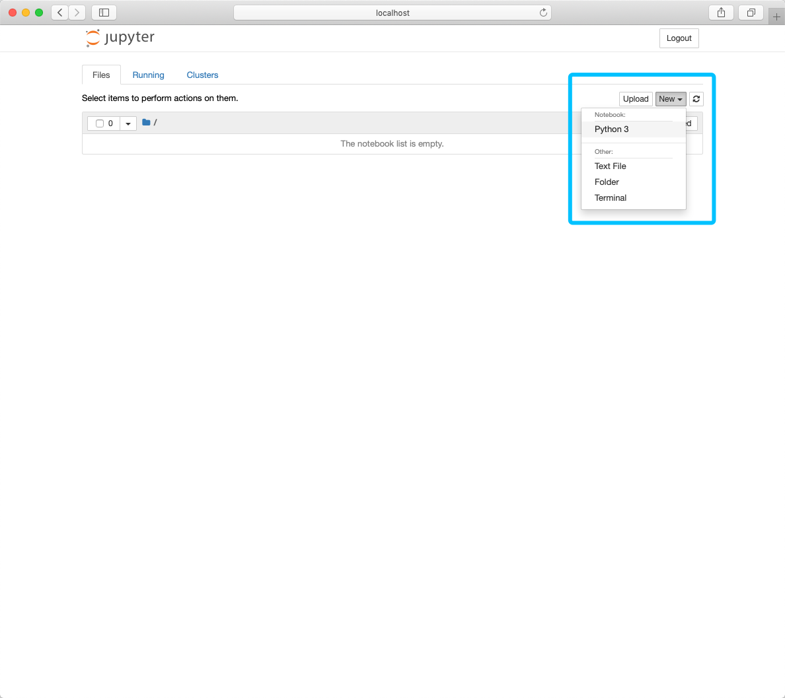
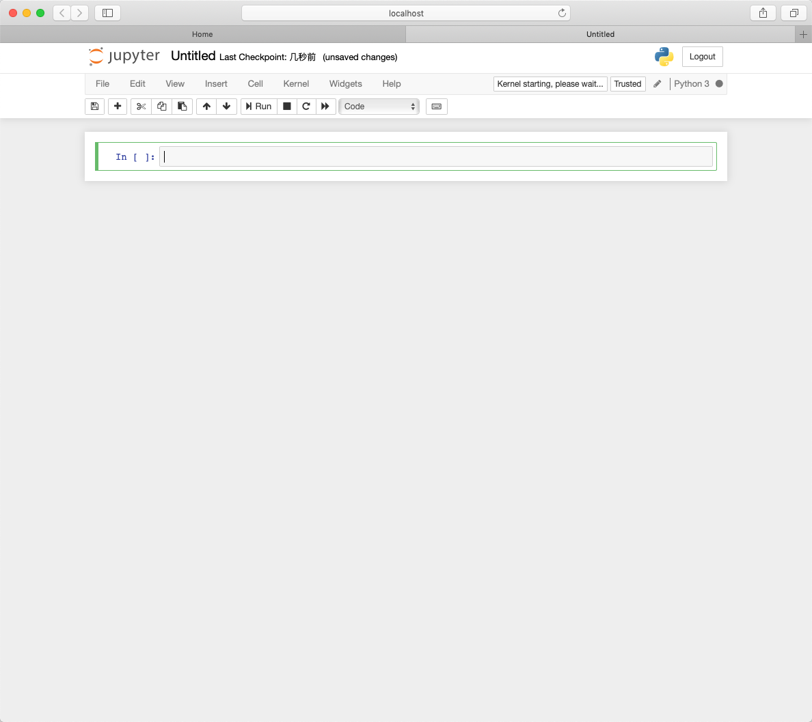

# WTM 北京 2019 Python 从 0 到 1 工作坊

## 主要内容

围绕使用 Python 的一个重要场景「数据获取、处理与分析」展开用入门编程的第一课。介绍一下内容：

1. Python 的基本介绍
2. Python 的环境安装
3. Python 最基本的语法
4. 用 Python 处理 csv 格式的数据
5. 用 Python 获取网页中的数据

这里主要介绍 Python 的一些背景资料以及我们所需要的 Anaconda 的环境准备。后面的部分将利用 Jupyter Notebook 这一工具所提供的交互式界面进行介绍。

## Python 的基本介绍

Python 最近几年由于在机器学习以及数据分析领域的出色表现变得越来越流行。其简单易懂的语法以及丰富的开发工具也让其成为了入门编程学习的最佳语言。

## Python 环境的安装

介于我们会更倾向于用 Python 做数据的获取、处理与分析，我们推荐大家使用 Anaconda，一个基于 Python 做数据分析处理与机器学习的开发环境安装包。它打包了在这个场景下会经常使用的重要工具、类库。大大简化了环境安装的成本。

首先打开官网 [https://www.anaconda.com/distribution/](https://www.anaconda.com/distribution/) 按照自己的操作系统的不同选择不同的安装包下载。

### 安装流程

首先在下载页面看到如下的界面，依据自己的操作系统选择 Windows / macOS 或者 Linux。


注意这里下载 **Python 3.7 version**，后面的教程全都基于这个版本。我们以 Windows 为例，下载 **64 Bit Graphical Installer**，有 600MB+，还是需要一阵子才能下载完成。

下载完成后双击下载包，如下所示：


点击下一步，采用默认的配置。


继续下一步，可以看到这次安装需要 3.1 GB 的空间，注意为自己的电脑腾出这么多空间。


下一步，保持下图中的配置：


继续下一步，开始安装：


视具体电脑配置不同，可能需要 5 到 10 分钟的时间。


安装完成后，在「桌面」点击「开始」，可以看到新安装的 Anaconda 组建：


我们之后主要用到的是「Anaconda Prompt」以及「Anaconda Navigator」。

### 使用 Anaconda 打开 Python

在「开始」菜单中点击「Anaconda Prompt」会跳出一个黑色的框框，也就是「命令行窗口」。


输入 `python` 可以看到如上的信息，显示我们在使用 Anaconda 下的 Python 3.7。

### 查看 Anaconda Navigator 

在「开始」菜单中点击「Anaconda Navigator」会跳出 Anaconda 的管理页面。



默认的「Home」选项卡会看到 Jupyter Notebook，也是我们接下来要主要使用的开发工具。



下面的「Environment」选项卡展示了目前 Anaconda 默认安装了哪些 Python 类库。



> Python 类库就是指其他人写的 Python 甚至是其他编程语言所写的程序，直接复用他人的代码可以大大提升我们的开发效率。

### macOS 下的安装与使用

在 macOS 下，Anaconda 的安装大体相同，只是在安装成功后打开「命令行」的方式略有不同：

首先打开小火箭 lauchpad：


找到「其他」



点击终端



## Jupyter Notebook 的使用

Jupyter Notebook 可以理解是是一个可以执行 Python（其实还可以执行其他编程语言）代码的记事本。很多介绍编程的书籍会在介绍的过程中嵌入一些代码片段，但这种代码片段只能被查看而已，但 Jupyter Notebook 则是一个可以让嵌入的代码片段可以被读者随意修改并执行的环境。一方面它非常适合那种一边讲解一边呈上代码执行的场景，被很多做数据分析以及机器学习的人所青睐。另一方面，它作为一种交互式的编程环境也非常适合我们在入门编程时使用。

### 打开 Jupyter Notebook

首先，按照上文所属的方式，打开一个「命令行」，然后创建一个新的文件夹并进入：

```
mkdir learn-python
cd learn-python
```

然后，输入一下内容开启 jupyter notebook:

```
jupyter notebook
```

如果一切正常你会看到「命令行」里出现了如下的信息，并且浏览器弹出一个新的页面：





点击右上角的「New」创建一个 Python 3 的文档：



这时候会有一个新的页面弹出来：



我们第一个 Jupyter Notebook 文件的创建就完成了。
